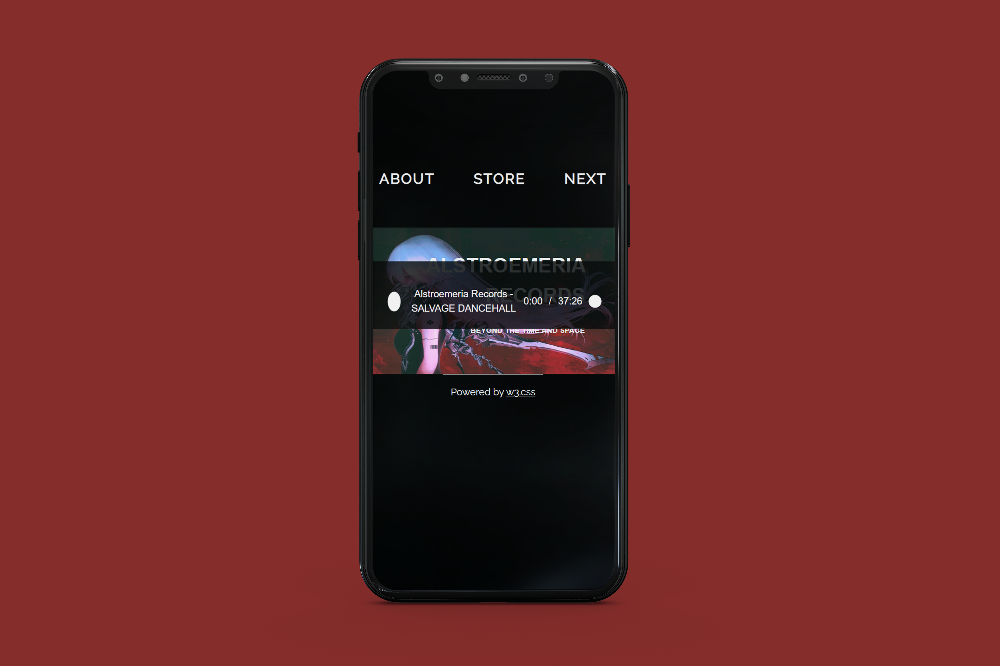

<html>
    <body>
        <h1> Proyecto para examen: desarrollo y adaptacion del diseño de una página web </h1>
        <!-- Buscar en "How to" de W3 -->
        <h4> Por Camila Parada </h4>
         
        <h2> Contexto </h2>
          
 El portafolio es un documento indispensable para conseguir un trabajo. Este tiene la función de exponer todo el trabajo de una persona, contando con documentación (escrita, visual, etc). No sólo un contenido es importante, sino también la forma de cómo éste se presenta y se expone ante un cliente. En la era de la información la mejor estrategia de llegar a un público más amplio es mediante redes sociales y páginas web. Estás últimas cuentan con la ventaja de ofrecer nuevas e innovadoras experiencias para quienes estén dispuestos a ingresar en ellas.  Para ello este proyecto busca centrarse en la creación de un portafolio musical que pueda exponer demostraciones de audios. 

         
        <h2> Planificación </h2>
          
 Dado que no es una labor fácil el aplicar un diseño a este medio se requerrirán de tomar ciertas medidas para poder desarrolar el trabajo en el tiempo estimado (cerca de 1 semana):

        <ol>
         <li> Centrarse en la estructura de una página ya existente, indagando hacerca de su construcción. Esta será la base para el proyecto, el cual será referenciado en las líneas de código estimadas.</li>
         <li> Usar contenido de referencia, es decir, ningún proyecto vinculado a mi persona. Para ello se creará un listado de páginas web que rediriga a los origenes de los elementos fabricados por otros autores. Estos serán recursos que sólo se encontrarán en internet </li>
         <li>La interactividad será agregar una ambientación musical a la página (de ser posible sin mostrar un visualizador de audio).</li>
        </ol>
         
        <h2> Previsualización final del sitio </h2>
        <video src="./previsualizaciones/video-pagina-completa-escritorio.mp4" width=320  height=240 controls></video>  
           
 Escritorio 

          
           
 Celular 

          
         
        <h2> Referencias de páginas web </h2>
        <ul>
         <li> https://wangzhihong.com/ </li>
         </ul>  
        <h2> Recursos utilizados </h2>
         <ul>
            <li><a link="https://chat.openai.com/share/6a2dee92-3966-4e61-8fa1-ba324cfa133f"> Chat GPT</li> 
            <li><a link="https://twitter.com/0TL_/media"> Portada </li>
            <li><a link="https://tatsdesign.com/Alstroemeria-Records"> Logotipo </li>    
            <li><a link="https://alst.net/"> Inspirado en esta página </li>    
         </ul>
         
        
 De este trabajo aprendí que no es para nada fácil el diseño de una web, dado que los códigos pre-hechos son necesarios el analizar cada línea de código para poder establecer nuevas experiencias, razón por la cual considero que se puede trabajar de mejor manera en un sitio web creado desde cero por uno mismo, pese a que conlleva el problema de requerir una mayor cantidad de tiempo. En ese sentido me vi limitada al involucrarme en un periodo de prueba y errores consecutivos, en el que sólo pude generar una adaptación del diseño de la página y unas leves interacciones cómo botones.

    </body>
</html>
